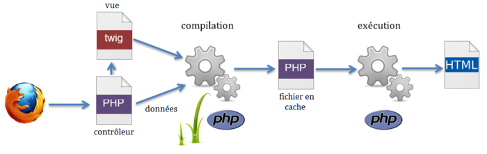

# TP - Twig

---
## Objet de ce TP

Le but de ce TP est d'utiliser un moteur de templates pour PHP.


Aussi appelées "vues", les templates servent la partie **V** du design pattern **MVC**. C'est-à-dire que ces templates sont dédiés à l'affichage. 

Ils permettent donc de **séparer** la partie affichage (**frontend** HTML) de la partie code (**backend** PHP). 

Ainsi, avec un moteur de templates, lorsque vous faites du **PHP**, vous n'avez pas des balises HTML dispersées dans le code, qui gênent la lecture. De même, lorsque votre infographiste fait du **HTML**, il ne sera pas gêné par votre code PHP.

Ce n'est pas du PHP, mais c'est plus adapté et voici pourquoi :

- La syntaxe est plus concise et **plus claire**. Ainsi, pour afficher une variable, `{{ variable1 }}` suffit, alors qu'en PHP il faudrait écrire `<?php echo $variable1; ?>`.

- Il y a quelques fonctionnalités très **pratiques**, comme l'héritage de templates.

- Il **sécurise** vos variables automatiquement : plus besoin de se soucier de `htmlentities()`, `addslashes()`...

Nous allons créer un petit projet en PHP, en utilisant Twig, qui va nous permettre de bien séparer le code HTML du code PHP.

---
## Fonctionnement de Twig

Le script PHP appelé par le navigateur, récupère les données et les met à disposition du template. 

Le template est analysé et compilé par le moteur de template en un fichier PHP. 

Ce dernier est placé dans le répertoire de cache afin de limiter la consommation de ressources sur le serveur. 

Une fois ce fichier exécuté, le code HTML est généré et transmis au navigateur.




Documentation sur Twig : `https://twig.symfony.com/doc/3.x/`

> Pour info, Twig est le moteur de templates utilisé par défaut par le framework Symfony. Il a été inspiré par Jinja, moteur de templates pour le language Python.


---
## Installer les outils nécessaires

1. installer `composer` : https://getcomposer.org/download/
2. si besoin, installer `git` : https://git-scm.com/downloads/
3. si besoin, installer `Visual Studio Code` : https://code.visualstudio.com/


---
## Créer un dépôt dans Github "twig-tp"

1. se connecter à Github
2. créer le dépot **public** "twig-tp" (.gitignore `Symfony` + LICENSE `MIT` + README)
3. copier l'adresse `https://...` du dépôt
4. ouvrir le terminal Windows, et se placer dans le dossier avec vos initiales (par exemple D:\LB)
5. exécuter la commande `git clone ` suivie par l'adresse `https://...` du dépôt (par exemple `git clone https://github.com/VOTRE-COMPTE/twig-tp.git`)
6. `cd twig-tp`


---
## Créer le projet 

1. `composer init`
- Package name : VOTRE-NOM/twig-tp
- Description : Small project to learn the twig tool
- Author : VOTRE-NOM \<VOTRE-ADRESSE-EMAIL\>
- Minimum Stability : stable
- Package Type : project
- License : MIT
- Would you like to define your dependencies : no
- Would you like to define your dev dependencies : no
- Do you confirm generation : yes


---
2. `composer install`


---
3. `code .`


---
4. installer le package de Twig :
```
composer require "twig/twig"
```
> L'opération, de téléchargement des dépendances, peut être longue...


---
5. créer le dossier `src` 
> Ce dossier va contenir les fichiers sources de notre projet PHP.


---
6. créer le dossier `templates` 
> Ce dossier va contenir les fichiers de nos modèles de pages HTML.


---
7. créer le dossier `cache` 
> Ce dossier va contenir les fichiers compilés de Twig.


---
8. ajouter les lignes suivantes dans le fichier `composer.json` (ajouter si besoin une virgule) :
```
    "autoload": {
        "psr-4": { "App\\": "src/" }
    }
```


---
9. créer le fichier `src/index.php` :
```
<?php
require_once '../vendor/autoload.php';

// Définir le dossier où se trouvent les templates
$loader = new \Twig\Loader\FilesystemLoader('../templates');

// initialiser l'environnement de Twig et définir le dossier du cache
$twig = new \Twig\Environment($loader, [
    'cache' => '../cache',
]);

// Affecter les variables du template et appeller le rendu
echo $twig->render('base.html.twig', 
    [
        'title' => 'Essai de Twig',
        'text' => 'Texte inséré dans la page.',
    ]
);
```


---
10. créer le fichier `templates/base.html.twig` :
```
<!DOCTYPE HTML>
<html>
  <head>
    <meta charset="utf-8">
    <title>Logiciel - {{ title }}</title>
  </head>
  <body>
    <h1>Logiciel - {{ title }}</h1>
    <p>Voici une page HTML, complétée par le texte : {{ text }}</p>
  </body>
</html>
```

> Le fichier `templates/base.html.twig` contient un code HTML statique, ainsi que du code twig. Les parties dynamiques du code entre délimiteur double accolades {{ }} seront remplacées lors de l'exécution par les valeurs des variables `title` et `text`.


---
11. démarrer le serveur web : `php -S localhost:8000 -t src` 


---
12. ouvrir la page `http://localhost:8000` avec votre navigateur favoris


---
13. vérifier le fichier compilé dans le dossier `cache/`


---
14. modifier les fichiers et `templates/base.html.twig`, et vérifier que les modifications **ne sont pas** prises en compte


---
15. effacer les fichiers présents dans le dossier `cache/`, et vérifier que les modifications **sont** prises en compte


---
16. envoyer les fichiers sources vers votre dépôt sur Github :
```
git add .
git commit -m "First commit"
git push
```


---
17. vérifier l'arrivée de vos fichiers sur `https://github.com/VOTRE-COMPTE/twig-tp`


---
18. Résumé des 3 types de la syntaxe Twig : 
- `{{` ... `}}` : **affiche** quelque chose (une variable)
- `` : **fait** quelque chose (une commande)
- `{#` ... `#}` : n'**affiche rien** et ne fait rien (commentaire)


---
19. Voici des exemples de commandes : 

- pour une **assignation** : ``
- pour une **condition** : `` ... ``
- pour créer un **compteur** dans une boucle :
  `` ... ``
- pour créer un tableau **itératif** :
  ``
- pour créer un tableau **associatif** :
  ``
